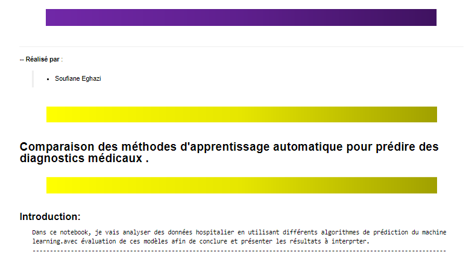
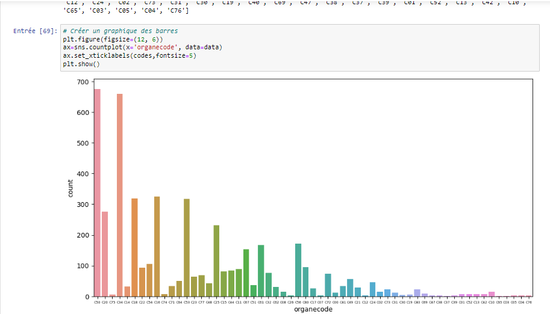
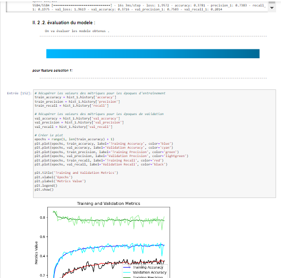
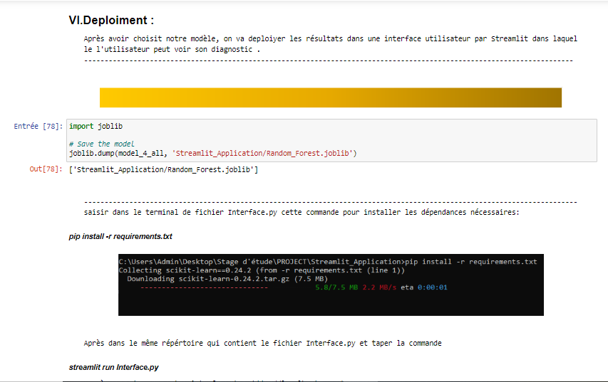
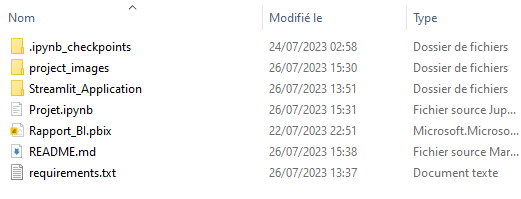

# Comparaison des méthodes d'apprentissage automatique pour prédire des diagnostics médicaux 

In this notebook, I will analyze data from an hospital using different machine learning prediction algorithms, with evaluation of these models in order to conclude and present the results to be interpreted.



## Overview

Before starting , i first created a dashboard using Power BI to visualise and understand more the dataset so that i could be able to detecte the errors and the mismatched values.


Next, before starting to build models, we must perform exploratory data analysis to understand the data. we can use Python libraries such as Pandas, Numpy, Seaborn and Matplotlib to visualize data and perform descriptive statistics



Next , we split the dataset to Train and Test datasets, then we will use a variety of classification algorithms on the training dataset and metrics to evaluate them so that we choose one of them



In the end , we will deploy the results in a user interface created by Streamlit in which the user can sees his diagnosis.



## Table of Contents

- [Directory](#directory)
- [Installation](#installation)
- [Usage](#usage)

## Directory
The folder Project contains:
- ".streamlit" folder : contains the application configuration

- "project_images" folder: contains images 
- "Streamlit_Application" folder : contains the application code.
- "Rapport_BI.pbix" : Contains the Power BI dashboard.
- "Projet.ipynb" : contains the notebook code.
- "README.md"  : the current file
- "requirements.txt" : contains the packages you need to install



## Installation

To use the Notebook and considering you have Python installed, you will need to install the following dependencies:
- numpy
- pandas
- seaborn
- matplotlib
- scikit-learn== 1.2.2
- imbalanced-learn
- scipy
- imblearn
- tensorflow
- keras

You can install the required packages using pip. Here's an example command:
```bash
pip install -r requirements.txt
```
<span style="color:red">Make sure that you navigate to your project folder inside the PROJECT folder, which contains the requirements.txt file.</span>

## Usage

After you installed the required packages,you can run the notebook and visualise the results .

<span style="color:yellow">You must know that to run the whole notebook it may take few hours to run due the massive amount of calculations it does!!.</span>


For the application code , you must go the "Streamlit_Application" folder , you will find a README.md file that explains to you how to run it.


