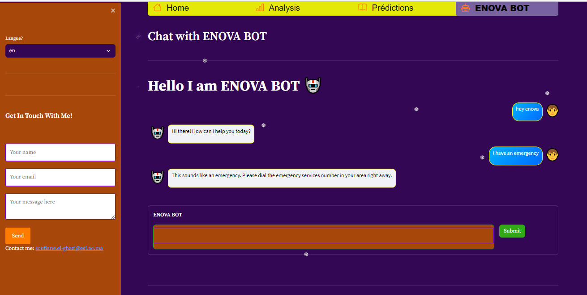
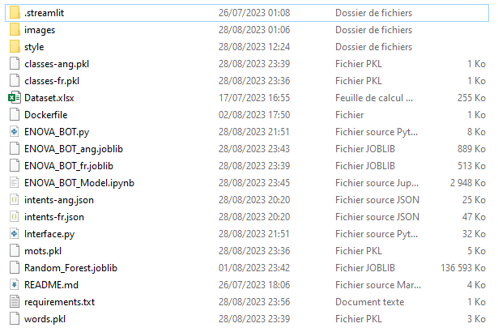
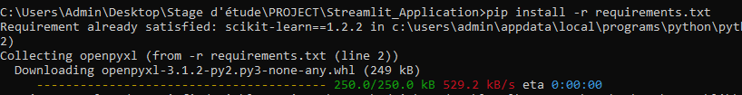
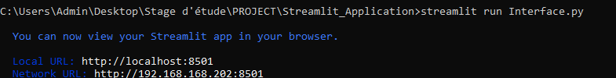
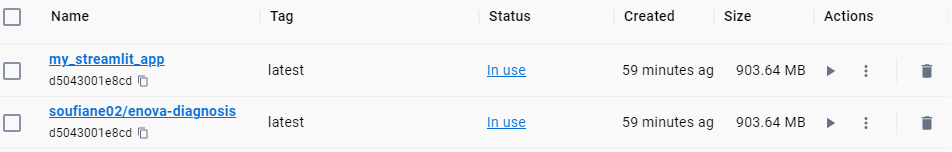

# ENOVA&RT Diagnosic

ENOVA&RT Diagnostic is a website that provides cancer diagnosis for users by predicting the organecode based on the information provided.


## Overview
The model used in this application is trained on the Dataset "Streamlit_Application/Dataset.xlsx" using Random Forest algorithm ,you enter your values and the model gives you the pridected value of your organecode,
and there is a dashboard that gives some statistics of the dataset and a section that shows the dataset cleaned of course. 
## Table of Contents

- [Directory](#directory)
- [Installation](#installation)
- [Usage](#usage)

## Directory
The folder Streamlit_Application contains:
- ".streamlit" folder : contains the application configuration

- "images" folder: contains the pictures of the app
- "style" folder : contains the style.css of the app
- "Dataset.xlsx" : Our dataset
- "Interface.py" : contains the app code
- "README.md"  : the current file
- "Random_Forest.joblib" : Contains Our model
- "words.pkl" : contains the words of the english model
- "mots.pkl" : contains the words of the frensh model
- "classes-fr.pkl" : contains the classes of the frensh model
- "classes-ang.pkl" : contains the classes of the english model
- "intents-fr.json" : contains the intents of the frensh model
- "intents-ang.json" : contains the intents of the english model
- "ENOVA_BOT_fr.joblib" : contains the frensh bot model
- "ENOVA_BOT_ang.joblib" : contains the english bot model
- "ENOVA_BOT_Model.ipynb" : contains the training of The chatbot models 
- "ENOVA_BOT.py" : contains the functions of The chatbot  
- "requirements.txt" : contains the packages you need to install
- "Dockerfile" : Code for docker image



## Installation

To use the application and considering you have Python installed, you will need to install the following dependencies:
- scikit-learn == 1.2.2
- openpyxl
- imblearn
- pandas
- streamlit
- streamlit-option-menu
- Pillow
- requests
- streamlit-lottie
- plotly
- joblib
- nltk
- numpy
- keras
- matplotlib
- imbalanced-learn
- dataclasses
- typing-extensions
- tensorflow

You can install the required packages using pip. Here's an example command:
```bash
pip install -r requirements.txt
```
<span style="color:orange">Make sure that you navigate to your project folder inside the Streamlit_Application folder, which contains the requirements.txt file.</span>


## Usage

#### Méthode1:

After you installed the required packages,To start the Application , run the following command:

```bash
streamlit run Interface.py
```
<span style="color:orange">Make sure that you are in  your project folder inside the Streamlit_Application folder, which contains the Interface.py file.</span>


The application will launch in your browser (http://localhost:8501/).



#### Méthode2:
If you have docker installed in your machine , you run it then you open your terminal and run the following command to Pull the Docker Image:

```bash
docker pull soufiane02/enova-diagnosis:latest
```
<span style="color:green">Make sure that you are connected to the internet.</span>

After the image is pulled, you can use the docker run command to create and start a container based on your image. tap in the same terminal:

```bash
docker run -d -p 8501:8501 soufiane02/enova-diagnosis:latest
```
Now you can access your application by navigating to http://localhost:8501/ in your web browser




 You can navigate throught the different sections of the app and you can sent me an email if there is anything i can help you with .
